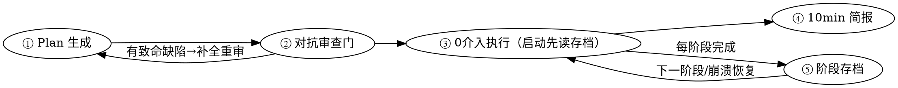

# 长周期任务执行宪章

## 概述

长任务执行的**最高原则：0 人工介入**。一旦启动，全程不向用户提问——任何"需要人类决策"的点，都必须在 plan 阶段消解为默认动作。本 skill 是原则层；当任务内部包含模型训练时，叠加 [model-train](../model-train/SKILL.md)（领域层，其训练场景规则覆盖本 skill 的通用规则）。

**崩溃可恢复：长任务（多阶段，如 训练A→训练B→训练C）每完成一个阶段必须打存档点**，记下产物位置 + 数据结果 + 下一阶段起点。任务重启时**先读最近存档**从该点续跑，不丢前序成果、不从头重来。详见阶段⑤。

**工程原则：能用脚本完成的，不依赖大模型。** 本 skill 大量内容是行为约束（对抗审查、决策拍板、plan 生成）必须靠 LLM；但确定性部分（`.tmp/` 骨架生成、时间戳、入参快照、阶段存档读写）用脚本完成：
- [init_lt_task.py](init_lt_task.py) — 进度文件骨架
- [checkpoint.py](checkpoint.py) — 阶段存档（save/list/show-latest）

## 何时使用

满足任一即触发：
- 任务预估跨多次会话 / 上下文会超 80%
- 用户明确要求「0 介入 / 无人值守 / 跑完再叫我 / 你自己搞定」
- 步骤多、含外部依赖（GPU/数据集/磁盘）与失败兜底分支

**不使用**：单次会话能完成、无分支、无外部依赖的简单任务。

## `.tmp/` 目录约定

`.tmp/` 下每个长任务独占一个子目录，按「任务启动日」组织：

```
.tmp/
├── 2026-07-21/
│   ├── train-rp-base/
│   │   ├── train-rp-base.md             ← 进度文件（人手读）
│   │   ├── train-rp-base_checkpoints.json ← 存档索引（机器读）
│   │   └── task_meta.json               ← 侧车元数据，记启动日（init 写入）
│   └── eval-rp/
│       ├── eval-rp.md
│       └── eval-rp_checkpoints.json
└── 2026-07-22/
    └── train-rp-v2/
        └── …
```

- 日期 = 任务启动当日（`init_lt_task.py` 时取 `now()` 写入 `task_meta.json`，跨天不挪窝）。
- `checkpoint.py` 启动时先 rglob `task_meta.json` 找回任务目录；找不到则 fallback 当日目录并打 WARN。
- 单任务的所有临时文件（测试/调试产物）都放该子目录，不再散落 `.tmp/` 顶层。
- 任务彻底完成 → 删**整棵子目录**（`rm -rf .tmp/<日期>/<slug>/`），不再只删单文件。

## 五阶段流程



### ① Plan 生成（包装 writing-plans）

调用 `superpowers:writing-plans` 产出结构化 plan，并强制注入以下约束。

**0 介入三铁律（不可违反）：**
1. **穷举所有分支**：NaN / OOM / 中断 / 资源不足 / 数据缺失，每条都要有兜底动作。
2. **外部依赖前置校验**：conda env、GPU、数据集、磁盘空间写进 plan 起始校验段；校验失败 → 走自愈路径，**不是反问**。
3. **禁止中途反问**：任何"需人类决策"的点，在 plan 阶段就定为默认动作 + 记入 `.tmp/` 的「决策快照」段，让用户**异步、非阻塞地否决**——绝不搞"跑通后集中 review"（集中 review 本身就是一次人工介入节点）。

**规范冲突仲裁（最高优先级）：**
CLAUDE.md「新增函数需与用户沟通确认」+ memory「未经允许不得 commit」是**常驻规范**；但本任务用户已明令 0 介入。**冲突时，一次性任务约束 > 常驻规范**。因此本任务期间：
- 新增函数**免逐个确认**（但须在 `.tmp/` 决策快照段记录新增清单，供事后审计）。
- 收尾 commit 与否，在 plan 阶段就定为默认动作（默认**不 commit**，对齐 never-commit）。
- 不确定时，记 `.tmp/` 让用户异步否决，而非当面反问。

**小步快跑优先**：plan 不要过度前置规划。尽早产出一个**能跑的最小 demo** 验证 pipeline，再迭代——而非先铺一份完美多步计划（上下文被压缩后完美计划反而成负担）。

### ② 对抗审查门（替代人工 checkpoint）

`writing-plans` 本会要求人工 checkpoint；**0 介入模式下不触发**，改由本门替代——「机器审查通过」=「可无人执行」。

**用 `Workflow` 工具 fan-out 并行 N 个 agent**（每个维度一个独立 agent，parallel/phase 编排，**并行非串行**），每个从一个维度**攻击** plan，目标是找出"会让执行卡住、被迫求助用户"的漏洞。

固化 **5 维度 fan-out schema**（LLM 可按 plan 性质增减维度）：

| 维度 | 攻击目标 | schema 关键字段 |
|---|---|---|
| 分支完备性 | 未覆盖的 if/else、边界条件 | `{failures: [{stage, condition, impact}]}` |
| 环境资源依赖 | conda env / GPU / 数据集 / 磁盘是否前置就绪 | `{missing: [{dep, check_cmd, fallback}]}` |
| 失败自愈 | 异常能否续跑、有无 fallback | `{uncovered_failures: [{trigger, recovery}]}` |
| 中断点扫描 | 哪些步骤隐含「需人类决策」 | `{decision_points: [{step, blocking}]}` |
| ETA 合理性 | 预估时长是否靠谱 | `{steps: [{step, est_min, basis}]}` |

**执行规约**：

- 1 个 agent = 1 个维度，prompt 模板：「针对这份 plan，从<维度>角度攻击，按 schema 输出结构化缺陷」
- `Workflow.parallel(...)` 并行收集 5 个 agent 输出；用 `phase('AdversarialReview')` 归到同一进度组
- 致命缺陷（schema 任一字段非空且标注 `blocking: true`）→ 补全 plan → 重审，**直到无致命缺陷**才放行
- 非致命警告（ETA 不准、缺失非关键 dep）→ 记 `.tmp/<日期>/<slug>/`「关键决策」段默认值放行，**不阻塞执行**
- 致命 vs 非致命：影响「能否无人跑完」为致命；只影响「跑得好不好」为非致命

> fan-out 的本质：5 个 agent 互不知道彼此存在、各自独立审视，dedup 靠后续聚合阶段；任何串行「agent 2 看 agent 1 结论」都是反模式。

### ③ 0 介入执行 + `.tmp/` 进度恢复

**启动硬规则（不可跳过）：先读存档。** 多阶段任务重启时，第一个动作必须是：
```bash
bash -lc 'cd <工程根> && python .claude/skills/long-term-task-plan/checkpoint.py show-latest --task <任务标识>'
```
- 有存档 → 从 `RESUME_FROM=<下一阶段>` 续跑，**不重做已完成阶段**。
- 无存档 → 从头开始。
> 这取代了"凭记忆/凭 .tmp 推断进度"——存档是阶段级 ground truth，确定性读取。

**核心原则：能用脚本完成的，不依赖大模型。** `.tmp/` 骨架生成是确定性的（固定 schema + 时间戳 + 入参快照），用脚本而非手写。

- **初始化进度文件**（脚本，不手写）：
  ```bash
  bash -lc 'cd <工程根> && python .claude/skills/long-term-task-plan/init_lt_task.py \
    --name "<任务名>" --slug <任务标识> --input "key=value" ...'
  ```
  脚本生成 `.tmp/<YYYY-MM-DD>/<任务标识>/<任务标识>.md`，含本 skill 规定的完整 schema（决策快照段 / 新增函数清单 / 阻塞自愈记录等）。LLM 之后只负责**更新字段值**，不负责排版。

- **单任务一目录**：`.tmp/<YYYY-MM-DD>/<任务标识>/`，禁多任务堆叠（对齐 CLAUDE.md 收尾清理）。
- **固定 schema**（init_lt_task.py 生成）：

```markdown
# 任务：<名称>
- 任务标识：<slug>
- 启动时间：<UTC+8>
- 当前阶段：<阶段名>
- 已完成：
- 待办：
- 关键决策：
- 决策快照（异步否决区）：   ← 每个替用户拍板的默认值列这里，用户可随时否决，不阻塞执行
- 新增函数清单：             ← 本任务期间免逐个确认，事后审计用
- 阻塞 / 自愈记录：
- 下次简报时间：<UTC+8>
- 入参快照：<原始一次性入参>
```

- **上下文达 80%**：写 `.tmp/` → `/compact` → 读回 `.tmp/` 继续。
  - ⚠️ **如实认知**：你无法精确感知占用比，也未必能主动触发 `/compact`（它是用户侧命令）。**真实兜底只有一条**：每完成一个模块/阶段就把关键决策刷写进 `.tmp/`，这样压缩来了也能从 `.tmp/` 恢复。别把 `/compact` 当自动兜底上报。
- **任务完成**：删 `.tmp/<日期>/<任务>/` 整棵目录 + 所有临时测试文件。

### ④ 10min 简报（UTC+8）

由 Claude 会话内 `ScheduleWakeup` 驱动，汇报 **Claude 自身任务进度**（与训练机的日志解析式汇报区分）。

**模板**（最小字段）：
```
[<时间> CST] <任务名> 阶段=<阶段> 进度=<x%>
  待办/已完成要点
  阻塞或自愈：<有则写，无则「无」>
  ETA=<预计完成时间>
```

**诚实 limitation**：仅 Claude 会话存活期生效；会话退出后进度已落 `.tmp/`，重启可恢复，简报自然停止。

### ⑤ 阶段存档与崩溃恢复（多阶段任务必备）

长任务由多个阶段组成（如 训练A→训练B→训练C）。**每完成一个阶段，必须打存档点**——这是崩溃/会话中断后恢复的 ground truth，防止前序成果丢失、防止从头重来。

**语义**：类似 git commit（快照 + 可恢复），但**不进 git**——模型 `.pth` 等大文件由训练脚本自己存到 `output/`，存档**只记「产物在什么位置 + 数据结果是什么」的元数据指针**，绝不复制大文件。

**打存档点**（每阶段完成后，脚本，不手写）：
```bash
bash -lc 'cd <工程根> && python .claude/skills/long-term-task-plan/checkpoint.py save \
  --task <任务标识> --stage "<阶段名，如训练A>" \
  --artifact "ckpt=<产物路径>" --artifact "best=<产物路径>" \
  --artifact "loss_curve=<tensorboard 路径>" --artifact "eval=<eval 目录>" \
  --result "Car_3D_AP=<数值>" --result "loss_final=<数值>" \
  --next_start "<下一阶段名>" [--note "<备注>"]'
```
脚本落盘到 `.tmp/<YYYY-MM-DD>/<任务标识>/<任务标识>_checkpoints.json`，记：阶段序号 / 时间戳 / **产物位置指针**（路径）/ **数据结果**（metric/loss）/ 下一阶段起点。

> 产物位置由上游脚本（如 train_pipeline.py 的 OUTPUT_ROOT）决定，本脚本只记录「在哪 + 结果如何」，符合"能用脚本不依赖大模型"——确定性归档，LLM 只在阶段边界调一次。

**恢复时**（见阶段③启动硬规则）：`checkpoint.py show-latest` 读最近存档，从 `next_start` 续跑。

**任务彻底完成**：删 `.tmp/<日期>/<任务>/` 整棵目录（进度文件 + 存档索引 + 临时测试文件），对齐 CLAUDE.md 收尾清理。

## 嵌套 model-train 时

当长任务内部触发训练，叠加 model-train：
- **简报合并**：long-term 的进度简报 + model-train 的训练 metrics 汇报**合并为一份**（任务进度段 + 训练段），避免双播报。
- **周期统一 10min**。
- `.tmp/` 沿用本 schema，model-train 把 PID/LOG/ckpt 追加进同一文件。

## Rationalization 表（堵漏洞，源自 baseline 实测）

| 借口 | 现实 |
|---|---|
| 「这个分支概率太低，不用兜底」 | 0 介入下，任何未兜底的分支 = 卡死。必须兜底。 |
| 「上下文还早，不用写 .tmp/」 | 80% 阈值会突然到。进度没落盘 = 压缩后丢失。每完成一个模块就刷写。 |
| 「我先问用户确认下更稳」 | 违反 0 介入。默认动作 + 记 `.tmp/` 决策快照段，让用户异步否决。 |
| 「跑通后集中 review 一次就行」 | 集中 review 本身就是人工介入节点。决策点必须异步落 `.tmp/`，不等 review。 |
| 「CLAUDE.md 说新增函数要沟通、不能 commit」 | 0 介入任务期间，任务约束 > 常驻规范。新增函数免逐个确认（记 `.tmp/` 清单），默认不 commit。 |
| 「对抗审查太慢，跳过吧」 | 审查门是 0 介入的唯一质量保证。跳过 = 放弃无人执行前提。 |
| 「简报不重要，省了」 | 0 介入下用户唯一感知。必须按 10min 汇报。 |
| 「先把计划铺完美再动手」 | 过度前置规划在压缩后成负担。小步快跑，先出能跑的最小 demo。 |
| 「/compact 会自动兜底」 | 不会。你感知不到占用比也不能主动触发。真实兜底只有持续刷写 `.tmp/`。 |
| 「这阶段成果记 .tmp 进度文件就够了，不用打存档」 | `.tmp/` 进度文件是叙事性的，会被清理；阶段存档是结构化 ground truth（产物位置+结果），崩溃恢复靠它。多阶段任务每阶段必须 `checkpoint save`。 |
| 「任务重启我凭 .tmp 进度文件/记忆推断到哪了」 | 不可靠。必须 `checkpoint show-latest` 读 `RESUME_FROM`，从存档点续跑，不重做已完成阶段。 |
| 「存档把 .pth 也复制一份更保险」 | 大文件不该复制。存档只记位置指针，.pth 由训练脚本自己存 output/。 |

## Red Flags — 停下重来

- 执行中产生「要不要问问用户」的念头（应记 `.tmp/` 决策快照段，异步否决）
- 用「集中 review」「跑通再确认」这类说法（都是变相介入）
- 多阶段任务**启动时不读存档**就从头跑 / 凭记忆推断进度
- 多阶段任务**阶段完成后不打存档点**就进下一阶段
- 存档时复制大文件（.pth/图）而非只记位置指针
- `.tmp/` 进度文件不存在就开始压缩 / 跳过刷写
- 跳过对抗审查门直接执行
- 把 `/compact` 当自动兜底向用户打包票
- 简报周期超过 10min 或缺失

**以上任一 = 违反 0 介入，立即修正。**
