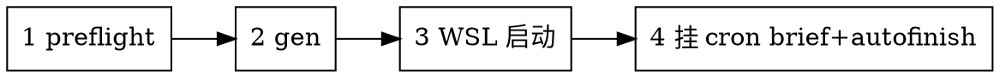

# 模型训练全链路

## 概述

RadarPillar 模型训练的**端到端 0 介入流水线**：一次性入参 → 调脚本生成 `.sh` → 启动 → cron 汇报 → 末 20 epoch val → best.pth → 实验记录。

**核心原则：能用脚本完成的，绝不依赖大模型。** 确定性/可解析/可模板化的任务（脚本渲染、自检、日志解析、best 挑选、记录生成）全部固化在 [train_pipeline.py](train_pipeline.py)；大模型只负责**解析用户自然语言入参 → 调脚本 → 处理异常**。

本 skill 是 long-term-task-plan 的**领域层**：训练场景下覆盖 long-term 的通用规则（10min 周期一致；嵌套时两份简报合并）。

### 0 介入硬规则（除非明确歧义，否则不准停下来问）

skill 一旦被触发（用户说"训练 X"），**全程不允许停下来询问用户**——包括训练中、出错时、调参时、写报告时。

**唯一允许询问的场景**（以下全不满足 → 直接拍板默认值继续跑）：
1. **`.sh` 模板不存在且无法自动造壳**——`make_shell` 找不到模板、CFG_FILE 替换失败、壳路径冲突等
2. **`.yaml` cfg 关键字段缺失或冲突**——`OPTIMIZATION.LR / BATCH_SIZE_PER_GPU / NUM_EPOCHS` 不在合理范围、或多个 cfg 同时匹配且互斥
3. **模型名无法推断**——同时存在多个候选 detector 类（e.g. RN MDFEN / RN FPN），用户没指明

**其它一切问题（NaN / OOM / 路径错误 / 显存不足 / 依赖缺失 / 数据加载失败 / val 跑不通 / pickbest 出错）必须由 skill 内部 loop + fanout 自动调查 + debug + 续跑，直至训练完成或本机资源硬性失败。**

> 严禁的"我先问一下"借口见底部 Rationalization 表。

## 何时使用

用户要求训练 RadarPillar 模型时（"训练 X"、"跑 X"、"开始训练 X"）。

**不使用**：纯 eval/推理（用 eval_radarpillar.sh）；tracker 仿真（非训练）。

## 一次性入参（收集后全程 0 介入）

| 入参 | 用途 | 必填 |
|---|---|---|
| 模型名 | `train_<模型>.sh` 文件名 + 日志目录标识 | 必填 |
| cfg 路径 | 训练 cfg；缺时自动在 `tools/cfgs/` 模糊匹配 | 必填 |
| 已有 `.sh` 模板路径 | 跳过自动造壳；缺则 skill 自动从 `train_radarpillar.sh` 模板造 | 可选 |
| 数据集 | OUTPUT_ROOT 数据集段 + cfg 命名一致性提示 | 必填 |
| 超参 | batch_size / workers / epochs / GPU | 默认 16/2/80/0 |
| 备注 tag | OUTPUT_ROOT 目录尾段 + `.tmp/<日期>/<slug>/` 的 slug 段 | 必填 |
| 是否可视化 | 写入 `.sh`（对齐 temp.md 第 6 点） | 默认 False |

> 缺失项用合理默认填，不反问——除非关键项（cfg/模型名）完全无法推断。

> **slug 命名建议**：调 `init_lt_task.py` 时 `--slug train-<模型>-<tag>`（例：`train-rp-base`），与目录约定对齐。`tag` 简短可读，不要含空格、日期（日期由 OUTPUT_ROOT 时间戳段承担）、特殊符号；`tag` 决定 `OUTPUT_ROOT` 尾段与 `.tmp/<日期>/<slug>/` 的 slug 命名。
>
> **模型名校验**：模型名走 `[a-z0-9_-]+`，非法字符（空格、`/`、`.`、中文等）会在 make_shell/gen 报错，避免路径注入。

## 端到端流程（每步都是脚本调用）


> 步骤 4 注册两条训练机 cron：brief（每 10min 训练汇报）+ autofinish（每小时检查，训完自动收尾）。两路都由训练机本地驱动，不依赖 Claude 会话。

### 执行约定

所有训练机命令统一经 WSL 下发（训练在 WSL2 Linux，Claude 在 Windows）：
```bash
bash -lc 'cd <工程根> && python .claude/skills/model-train/train_pipeline.py <子命令> ...'
```
**工程根与 conda env 名由各 `.sh` 内既有逻辑自探测**（`cd $(dirname)/../..` + conda 自激活），本 skill 不绑定具体路径/env，换机可用。

### 1. 启动前自检（preflight，护城河，不可跳过）

```bash
bash -lc 'cd <工程根> && python .claude/skills/model-train/train_pipeline.py preflight \
  [--model <模型> | --cfg_file <cfg>] --dataset <数据集> --batch_size <bs>'
```
- 未给 `--cfg_file` 时传 `--model`，脚本自动在 `tools/cfgs/` 定位 cfg（不靠 LLM glob）。
- 脚本自动核验：cfg 存在 / detector 类已注册（模型落地）/ 数据集可定位 / 列既有 OUTPUT_ROOT 命名风格 / batch 显存提示。**任一失败 → 退出码非 0，LLM 不得裸启动。**

> 这一步取代 LLM 手动 grep/Glob 核验——确定性检查就该交给脚本。

### 2. 生成 `train_<模型>.sh`（gen + 自动造壳）

```bash
bash -lc 'cd <工程根> && python .claude/skills/model-train/train_pipeline.py gen \
  --model <模型> --dataset <数据集> --cfg_file <cfg> \
  --batch_size <bs> --workers <w> --epochs <ep> --gpu <g> \
  --tag <备注> [--visualize]'
```

**自动造壳路由**（按 `train_<模型>.sh` 是否已存在）：

| 场景 | 动作 |
|---|---|
| `train_<模型>.sh` 已存在 | gen 仅渲染顶部 7 变量（CFG_FILE / BATCH_SIZE / WORKERS / EPOCHS / GPU / EXTRA_TAG / OUTPUT_ROOT），**不动壳内部** |
| `train_<模型>.sh` 缺 | gen 自动调 `make_shell`：复制 `train_radarpillar.sh` 模板 → 把 `CFG_FILE` 默认值行替换成 `--cfg_file` → 落盘 `train_<模型>.sh` |
| 想强制覆盖已存在壳 | 显式调 `make_shell --force` 或在 gen 前 `--no_auto_make_shell` 后手工 make |

仅造壳（不渲染顶部变量）：
```bash
bash -lc 'cd <工程根> && python .claude/skills/model-train/train_pipeline.py make_shell \
  --model <模型> --dataset <数据集> --cfg_file <cfg> [--force]'
```

**OUTPUT_ROOT 自动**：`output/train_log/<数据集>/<YYYYMMDDHH>_<模型>_<备注>/`

**壳内部默认（skill 规约，**不动**）**：
- `SKIP_EVAL=True`
- `SET_CFGS=("OPTIMIZATION.early_stop.enabled" "False" "OPTIMIZATION.LR_WARMUP" "False")`
- `RUN_MODE=background`
- conda env 自探测 `angle`

> 这一步取代 LLM 手动写 `.sh`——模板替换 + 自动造壳是纯确定性，不该靠大模型手写。

### 3. WSL 启动

```bash
bash -lc 'cd <工程根> && bash .claude/skills/model-train/train_<模型>.sh'
```
记录 PID / LOG 路径 / OUTPUT_ROOT 到 `.tmp/<YYYY-MM-DD>/<slug>/<slug>.md`（slug 建议 `train-<模型>-<tag>`，与 init_lt_task.py 同目录约定）。骨架复用 [init_lt_task.py](../../long-term-task-plan/init_lt_task.py)，沿用 long-term schema；LLM 在该文件里追加 PID/LOG/OUTPUT_ROOT 三个字段值。

### 4. 挂 cron：训练汇报 + 收尾（训练机本地驱动）

**关键：所有定时任务都在训练机本地 crontab 驱动，Claude 不参与定时循环。** Claude 会话一旦关闭，会话内 CronCreate 就失效；只有训练机本地 crontab 可靠。

注册两条 crontab：

**(a) 每 10min 简报**（brief）：
```bash
bash -lc '(crontab -l 2>/dev/null; echo "*/10 * * * * cd <工程根> && python .claude/skills/model-train/train_pipeline.py brief --model <模型> --log <LOG> --output_root <OUTPUT_ROOT> >> <OUTPUT_ROOT>/brief.log") | crontab -'
```

**(b) 每小时收尾检查**（autofinish，见步骤 5）。

brief 子命令自动解析 LOG（epoch/loss/lr/ETA/NaN/OOM）+ 按 temp.md 第 5 点模板格式化输出。**日志解析是确定性任务，绝不靠大模型 tail+理解。** brief 输出追加到 `OUTPUT_ROOT/brief.log`，是后续 `record` 子命令的简报历史数据源。**不要**用 `.tmp/<日期>/<slug>/` 替代——产物（`OUTPUT_ROOT/`）与临时进度文件（`.tmp/`）分开存放。

### 5. 收尾链（autofinish，训练机 cron 驱动，不依赖会话）

**关键：收尾（val→pickbest→record）也由训练机 cron 驱动，不依赖会话内 LLM poll。** 训练结束的判定与收尾串跑全部在脚本里完成——会话即使关闭，收尾也会自动触发。

注册一条额外的训练机 crontab（比 brief 低频，如每小时检查一次是否训完）：
```bash
bash -lc '(crontab -l 2>/dev/null; echo "0 * * * * cd <工程根> && python .claude/skills/model-train/train_pipeline.py autofinish \
  --model <模型> --dataset <数据集> --cfg_file <cfg> \
  --batch_size <bs> --workers <w> --epochs <ep> --gpu <g> \
  --tag <备注> --output_root <OUTPUT_ROOT> --log <LOG>") | crontab -'
```
autofinish 子命令自动：
1. 判定训练结束（目标 ckpt `checkpoint_epoch_<EPOCHS>.pth` 已生成）→ 未结束则跳过
2. **末 20 epoch 必须 val，不省**（复用 eval_radarpillar.sh 的 `all` 模式，`START_EPOCH=EPOCHS-20`）——无论 budget 多紧，val 区间不可缩
3. **pickbest 必跑，必须筛出 best.pth**（按 Car 3D AP 挑 best ckpt，落到 `<OUTPUT_ROOT>/best.pth`）——best 不留空、未挑出则 autofinish 视为失败
4. record：聚合配置/metric/best.pth/简报历史，生成 `experiments/<YYYYMMDDHH>_<模型>_<备注>.md`（参考 RPiN.md 风格）

> 这三步串跑是确定性的编排，不该靠会话内 LLM poll 触发。脚本判定训练结束即自动收尾。

收尾完成后，清理 `.tmp/<YYYY-MM-DD>/<slug>/` 整棵目录（用 `rm -rf`）+ 对应的 brief/autofinish 两条 crontab 条目。

### 6. 训练报告（autofinish 完成后 LLM 撰写）

脚本只产**原料**（experiments/<...>.md + best.pth + OUTPUT_ROOT/eval + 可视化），**报告文本由 LLM 手动撰写**，对齐 [`实验报告模板.md`](实验报告模板.md)（同目录下）的六章结构（实验设置 / 核心结果 / 关键排查 / 评价 / 后续 debug / 产物清单）。模板已留好 `<占位符>`，LLM copy 骨架填充即可。

**触发时机**：`autofinish` 跑完 `val → pickbest → record` 后，**LLM 一次性手写报告**；不靠 cron，不靠会话内 poll 触发。

**报告落点**：
- 建议位置：`note/<模型名>/<YYYYMMDD>_<模型>_<tag>_报告.md`
- 示例参照：`note/radarpillar复现结论.md`（已按这约定写好）

**图片引用约定**（**不拷贝，必须放 note/asset**）：

- **图一律放 `note/asset/<模型>/`**——LLM 写报告时直接渲染/绘制的图（如 loss 曲线、BEV 帧采样、debug 对比图）都落在此目录，不放别处
- 用 markdown 相对链接，**源图留在原地**——报告位于 `note/<模型>/`，相对路径须是 ``（不是 `asset/<模型>/...`）
- 资产目录约定 `note/asset/<模型>/` 下放：
  - `loss_curve.png`（训练 loss 曲线）
  - `tb_loss_curves.png`（tensorboard 截屏）
  - `<模型>_frames/frame_NNNNN.png`（BEV 帧采样 8 张）
  - 其它调试对比图
- 已有的 `note/asset/radarpillar/` 是参照样例

**报告输入原料**（LLM 从以下源头取数据，不用 grep 瞎找）：

- 配置 + metric + best 路径：`experiments/<时间戳>_<模型>_<tag>.md`（`record` 子命令产物）
- 简报历史：`OUTPUT_ROOT/brief.log`
- 评测原始数据：`OUTPUT_ROOT/eval/epoch_*/val/*/result.*`
- 可视化产物：见「图片引用约定」

> 报告含主观判断（gap 归因、后续 debug 优先级），**LLM 写，脚本不替写**——脚本替写会把判断偷渡成代码。

## 自愈（对齐 long-term 0 介入，**skill 内部 loop + fanout 自闭环**）

skill 检测到任何异常，**禁止停下来问用户**——必须触发内部 loop（重跑/降配/续 ckpt）和 fanout（并行探查根因），直至训练恢复或资源硬性失败。

| 异常 | 检测点 | 自愈动作（loop） | 调查动作（fanout） |
|---|---|---|---|
| **NaN loss** | brief 解析 LOG 发现 `NaN` | 1) 降 LR 50% 续最近 ckpt；2) 失败再降 batch；3) 失败再冻结 BN；4) 失败再切 AMP off | 并行探查：loss 曲线 / 梯度范数 / 异常 batch（用 task6_overfit_1batch.py 复现）|
| **OOM** | brief 解析发现 `CUDA OOM` 或 exit 137 | 1) bs 减半续跑；2) 失败清 `torch.cuda.empty_cache`；3) 失败降 workers；4) 失败切 `PYTORCH_CUDA_ALLOC_CONF=expandable_segments:True` | 并行探查：nvidia-smi 实测 / 显存峰值日志 / voxel 数分布 |
| **Loss 不收敛** | brief 检测 loss 平台/反弹 | 1) 续 ckpt 跑多 5 ep；2) 失败切 AdamW→SGD；3) 失败加载预训练 | 并行探查：lr schedule / data augmentation 强度 / label 噪声 |
| **ckpt 损坏 / 加载失败** | autofinish / record 触发时 | 跳过损坏 ckpt，从次新 ckpt 续 val | 并行探查：磁盘空间 / 文件系统 / 写入完整性 |
| **val 跑不通** | autofinish 触发 val | 1) 改 `shapely` 缺失路径；2) 切 `--eval_tag default`；3) 手动跑 test.py 单 epoch | 并行探查：NMS 配置 / score_thresh / ckpt 与 cfg 一致性 |
| **pickbest 无 best.pth** | autofinish 第 3 步 | 1) 放宽 SCORE_THRESH；2) 兜底取最近 ckpt 作 best；3) 失败标记训练失败 | 并行探查：eval 结果目录是否完整 / metric 文件是否写出 |
| **进程中断** | brief 检测 ckpt 不再更新 | 依赖 ckpt 续跑（`--ckpt`），`.tmp/` 记中断点 | 并行探查：OOM 痕迹 / 磁盘满 / 父进程退出 |
| **cron 未触发** | 简报连续 30min 无更新 | 重写 crontab 条目 + 立即跑一次 manual brief | 并行探查：crontab -l / cron daemon 状态 |
| **依赖缺失（pkg / .pyc / .so）** | preflight 失败 | 1) 走 skill 自带 `bootstrap.sh`（若存在）；2) pip install --user；3) 切 conda env | 并行探查：conda env / PYTHONPATH / LD_LIBRARY_PATH |
| **数据路径 / 软链断开** | VodDataset 加载 0 样本 | 1) 重建 symlink；2) 重跑 `create_vod_data.py`；3) 走备份数据目录 | 并行探查：ls -la / data/VoD/ 完整性 |

**升级人工（唯一例外）**：本机硬件级失败（GPU 烧了 / 磁盘写满 / conda env 物理损坏）——这种情况记 `.tmp/` CRITICAL 段，cron brief 标注，等用户修机器。**所有训练代码层面的问题，skill 必须自己闭环。**

## Rationalization 表（堵漏洞，源自 baseline 实测）

| 借口 | 现实 |
|---|---|
| 「脚本难记，我直接手写 `.sh`」 | 模板替换是确定性的，大模型手写易出错。必须用 `gen` 子命令。 |
| 「自检我自己 grep 一下就行」 | 确定性检查交给 `preflight` 脚本，别用大模型手动核验。 |
| 「简报我自己 tail 日志读一下」 | 日志解析是确定性的。必须用 `brief` 子命令 + cron 驱动。 |
| 「best 我自己看下哪个好」 | metric 比较是确定性的。必须用 `pickbest`（autofinish 内置）。 |
| 「训完我 poll 到进程退出再触发 val/record」 | 收尾靠会话内 LLM poll 会断流。必须用 `autofinish` + 训练机 cron，训练结束自动收尾。 |
| 「SKIP_EVAL 关掉，边训边 eval 更稳」 | 违反 temp.md 第 2 点。默认 SKIP_EVAL=True。 |
| 「末 20 epoch 太多，评 5 个就行」 | 违反 temp.md 第 3 点。必须末 20。 |
| 「cron 麻烦，我用 CronCreate 自己定时」 | 会话关闭就失效。必须训练机本地 crontab 驱动。 |
| 「模型/cfg 先猜个路径试试」 | preflight 会拦。未落地模型不裸启动。 |
| 「可视化我等会再配」 | 违反 temp.md 第 6 点。`gen` 时就要定 `--visualize`。 |
| 「`.tmp/` 文件随便放顶层也行」 | 违反 `.tmp/<日期>/<slug>/` 目录约定。进度文件按任务独占子目录，便于按日/按任务清理。 |
| 「脚本替我写报告省事」 | 报告含主观判断（gap 归因、后续 debug 优先级），LLM 写；脚本只产原料（配置 / metric / 路径）。 |
| 「图片我复制一份到 note」 | 用 markdown 相对链接，**不拷贝**。源图在 `note/asset/<模型>/`，删源图才需要重引。 |
| 「换模型我自己复制 `.sh` 就行」 | skill 现已支持自动造壳（`make_shell` + `gen --auto_make_shell`），用户不该手工复制。 |
| 「壳内部 cfg 默认值我自己改」 | `make_shell` 自动替换 CFG_FILE 默认值行；改其它壳内部行（conda / SKIP_EVAL 等）属于改规约，应当改 skill 模板而非手工改壳。 |
| 「NaN/OOM 我先停下来问用户怎么办」 | skill 必须自愈（降 batch / 降 LR / 续 ckpt），不允许问。问用户 = 违反 0 介入。 |
| 「loss 不收敛是不是我哪里搞错了，先确认下」 | skill 内部 fanout 探查 lr/aug/label；不是用户问题，不许问。 |
| 「这个超参我拿不准，问下用户」 | 用默认值（bs=8 / w=2 / ep=80 / GPU=0，sweep 结果）；拿不准 ≠ 不能跑。 |
| 「路径错了，先停下来问用户在哪」 | 走 preflight 自动重定位 / ls 自动列候选 / 自带 fallback。 |
| 「val 跑不出 best，我问下用户怎么办」 | autofinish 兜底取最近 ckpt 作 best，再 fanout 探查根因；不许问。 |
| 「训练中出错了，我描述给用户让他决定」 | skill 自己 loop + fanout 调；只有本机硬件级失败才升级人工。 |

## Red Flags — 停下重来

- 跳过 `preflight` 直接 `gen`/启动
- 手写 `.sh` 而非用 `gen` 子命令
- 手动 tail 日志做简报而非 `brief` + cron
- 手动比较 metric 挑 best 而非 `pickbest`（autofinish 内置）
- 收尾（val/pickbest/record）靠会话内 LLM poll 而非 `autofinish` + 训练机 cron
- 跳过末 20 epoch val
- 简报或收尾由 Claude 会话内驱动而非训练机 cron
- 训练中途反问用户超参/可视化
- **训练中遇到 NaN / OOM / 路径错 / val 失败时停下问用户怎么办** —— 必须走 skill 自愈（loop + fanout），只有本机硬件级失败才升级人工
- **任何"我先确认一下 / 我先问下 / 我描述给您看"之类的话术**——除 3 个明确歧义场景（.sh / .yaml / 模型名）外一律禁止
- 未生成实验记录 md 就宣告完成

**以上任一 = 违反训练规范，立即修正。**
