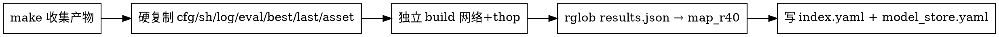

# resbag —— 训练结果落袋归档

## 概述

把一次训练/评估的产物**自包含硬复制**到 `<OUTPUT_ROOT>/resbag/`，并写一份同级的 `model_store.yaml` 单实验总览。`model-train` 的 `autofinish` 在 `record` 步骤之后自动调用 `resbag make`；外部训练也可手动调用。

### 何时使用

- model-train 的 autofinish 收尾链自动调（已集成）。
- 手动训练、外部脚本、调试单次跑完后想打包归档：直接 `python resbag.py make --output_root <DIR> ...`。
- 查询跨实验总览：`resbag list --dataset vod`。

### 不使用

- 不替 record：record 仍是训练流水线的实时记录（写 LLM 风格 md）；resbag 是归档快照。
- 不做冷备份/异地容灾：硬复制在本机 OUTPUT_ROOT 内，源与副本同盘。

## 一次性入参（`make` 必需）

| 入参 | 含义 | 来源 |
|---|---|---|
| `--output_root` | 训练/评估的根目录 | model-train autofinish 传；手动时从目录名中段解析 |
| `--dataset` | 数据集名（决定 `model_store.yaml` 父目录） | `cfg.DATASET` 或 directory 父段 |
| `--tag` | 训练备注（OUTPUT_ROOT 尾段） | model-train `--tag` 入参 |
| `--model` | 模型名（决定 train.sh 源 + 锁名） | model-train `--model` |
| `--cfg_file` | 训练 cfg（重算 params/flops 需） | model-train `--cfg_file` |
| `--batch_size` | 训练 batch（thop 标注用） | model-train `--batch_size` |
| `--note` | 自由文本备注（可选） | 用户 |

## 子命令

| 子命令 | 作用 |
|---|---|
| `make` | 主入口：硬复制 → 算 params/flops → 读 results.json → 写 index.yaml + model_store.yaml |
| `list` | glob `<dataset>/*/model_store.yaml` 聚合成跨实验总览（默认 stdout；`-o` 写另起的派生文件） |
| `show` | 打印单个实验 `model_store.yaml`（指定 `--folder`） |

## 落袋结构

```
<OUTPUT_ROOT>/
├── resbag/
│   ├── index.yaml         # 机读记录（与 model_store.yaml 等价 schema）
│   ├── README.md          # 人读（LLM 填结论/偏差/复现）
│   ├── cfg.yaml           # cfg 快照
│   ├── train.sh           # tools/scripts/train_<model>.sh 硬复制
│   ├── best.pth           # OUTPUT_ROOT/best.pth
│   ├── last.pth           # OUTPUT_ROOT/ckpt/checkpoint_epoch_<max>.pth
│   ├── train.log          # OUTPUT_ROOT/log_train_<YYYYMMDD-HHMMSS>.txt
│   ├── eval_results.json  # best_epoch 对应 results.json
│   └── asset/             # OUTPUT_ROOT/asset/ 整树硬复制
└── model_store.yaml     # 单实验总览（与 resbag/ 同级）
```

## 0 介入硬规则

- resbag 失败不阻塞上游（model-train 用 `check=False` 调）。
- resbag 自身：build 网络/thop 失败 → params_m/flops_g=null + note 注明；不抛、不阻塞。
- 写盘原子：`temp-file + os.replace`，损坏不留半成品。

## 端到端流程



### 1. 启动前自检（make 内部 try/except 兜底）

- `best.pth` 缺失 → status=blocked，note 注明，仍落袋其余。
- `eval_results.json` 缺失 → map_r40 全 null，status=blocked。
- params/flops build 失败 → null + note 注明，不阻塞。
- 权重硬复制失败（磁盘满）→ 报错退出，**不**产 index.yaml（防半成品）。
- 检测 `OUTPUT_ROOT/FINISHED_PARTIAL`（model-train 训练中途崩溃标记）→ status=blocked + note `crash@ep<max>`。

### 2. 硬复制实现

- 全部 `shutil.copy2`（保元数据）。
- last.pth 源 = `OUTPUT_ROOT/ckpt/checkpoint_epoch_<max>.pth`（max by epoch number，非 NUM_EPOCHS）。
- asset/ 整树硬复制（含 `<model>_frames/` 等子目录）。
- 幂等：重复 make 覆盖 index.yaml/model_store.yaml（按 ts 字段比对）。

### 3. 数据源（不解析 record md、不解析 train.log 文本）

| index.yaml 字段 | 数据源 |
|---|---|
| cfg.yaml | OUTPUT_ROOT/ 推理出的 cfg_path（make 入参 `--cfg_file`） |
| best.pth | OUTPUT_ROOT/best.pth |
| last.pth | OUTPUT_ROOT/ckpt/checkpoint_epoch_<max>.pth |
| best_epoch | best.pth 字节大小 ↔ ckpt/checkpoint_epoch_*.pth 匹配 |
| map_r40 | rglob results.json + best_epoch 匹配（**不**字面写路径） |
| map_r11 | 恒 null（eval.py 注释了非 _R40 键） |
| params_m / flops_g | cfg.yaml build 网络 + thop（独立实现） |
| commit | git rev-parse --short HEAD |
| seed | cfg OPTIMIZATION.FIX_RANDOM_SEED |
| optimizer | cfg OPTIMIZATION.{OPTIMIZER,LR,WD,DECAY_STEP_LIST} |
| train.log | OUTPUT_ROOT/log_train_<YYYYMMDD-HHMMSS>.txt（最新一份） |
| train.sh | tools/scripts/train_<model>.sh |
| eval_results.json | best_epoch 对应 results.json |

### 4. 写入原子性

写 `model_store.yaml` 强制用 temp-file + os.replace 模式：

```python
tmp = model_store.with_suffix(f'.tmp.{pid}')
yaml.safe_dump(data, tmp.open('w'), sort_keys=False, allow_unicode=True)
os.fsync(tmp); os.replace(tmp, model_store)   # 同目录 rename 原子
```

并发：per-experiment 单写主 + 同实验多次 make 用 `/tmp/resbag_store_<dataset>_<name>.lock`（fcntl.flock LOCK_EX 阻塞）串行化。

### 5. 调用方式

**model-train 自动调用**（集成后）：
```bash
python .claude/skills/resbag/resbag.py make \
  --output_root <DIR> --dataset <DS> --tag <TAG> --model <MODEL> \
  --cfg_file <CFG> --batch_size <BS> [--note <NOTE>]
```

**手动调用**：
```bash
python .claude/skills/resbag/resbag.py make \
  --output_root output/train_log/vod/2026072222_radarnext_mdfen_0722_paper \
  --dataset vod --tag 0722_paper --model radarnext_mdfen \
  --cfg_file tools/cfgs/model/vod_models/radarnext/vod_radarnext_mdfen.yaml \
  --batch_size 4
```

**跨实验总览**：
```bash
python .claude/skills/resbag/resbag.py list --dataset vod [-o vod_index.yaml]
```

**单实验查询**：
```bash
python .claude/skills/resbag/resbag.py show --folder 2026072222_radarnext_mdfen_0722_paper
```

## 与其他 skill 的关系

- **model-train**：autofinish 收尾链自动调 `make`（record 之后），传完整 7 入参 + cwd=ROOT + timeout=600 + check=False。
- **long-term-task-plan**：阶段贪心接力依赖 `resbag/best.pth` 作为稳定锚点；不再依赖 git HEAD 时的 cfg。
- **note/ 旧报告位置**：废弃。所有报告+图迁到对应 OUTPUT_ROOT 的 `resbag/README.md` + `resbag/asset/`。

## Rationalization 表

| 借口 | 现实 |
|---|---|
| 「归档复制一次够了吧，全硬复制占双倍空间」 | 单实验 <50MB，归档价值 > 空间成本（可加 `--no-last` 跳 last.pth） |
| 「总览放 dataset 中央更方便跨实验查」 | per-experiment 自包含更彻底；跨实验对比走 `list` 运行时聚合，无中央竞态 |
| 「train.log 反正 record 已经读过了，直接复用 record md」 | record 是 LLM 撰写的人读报告，不反喂；resbag 一律重读 cfg + 重算 |
| 「R11 和 R40 一起读」 | eval.py 注释了非 _R40 键，map_r11 恒 null；不要为不存在的字段写含糊逻辑 |
| 「eval 路径我写死 epoch_<best>/.../results.json 就行」 | FPN 走 eval_all_default 路径层数不同；用 rglob + best_epoch 匹配 |
| 「commit 取 HEAD 就够」 | 落袋时 HEAD 可能已偏；note 附 best epoch 反推训完时间 |
| 「resbag 失败让我看 stderr 就好」 | check=False 吞 stderr 太安静；落袋失败要让 record 后能看到——用 timeout 防止卡死但允许快速失败退出 |
