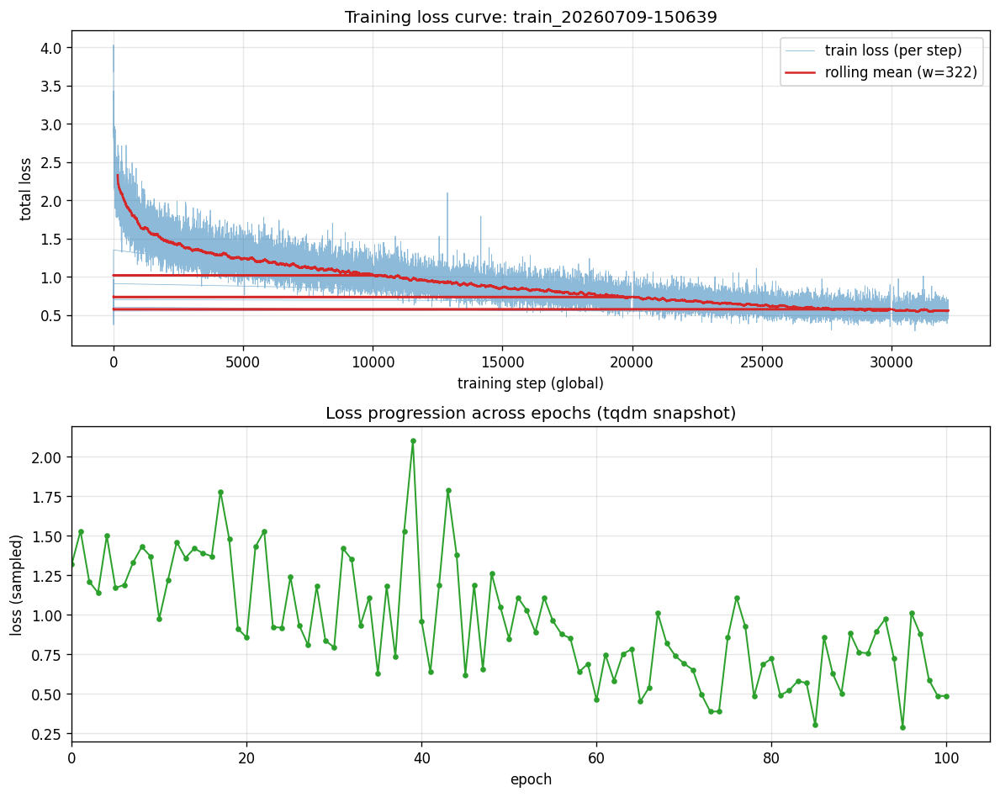
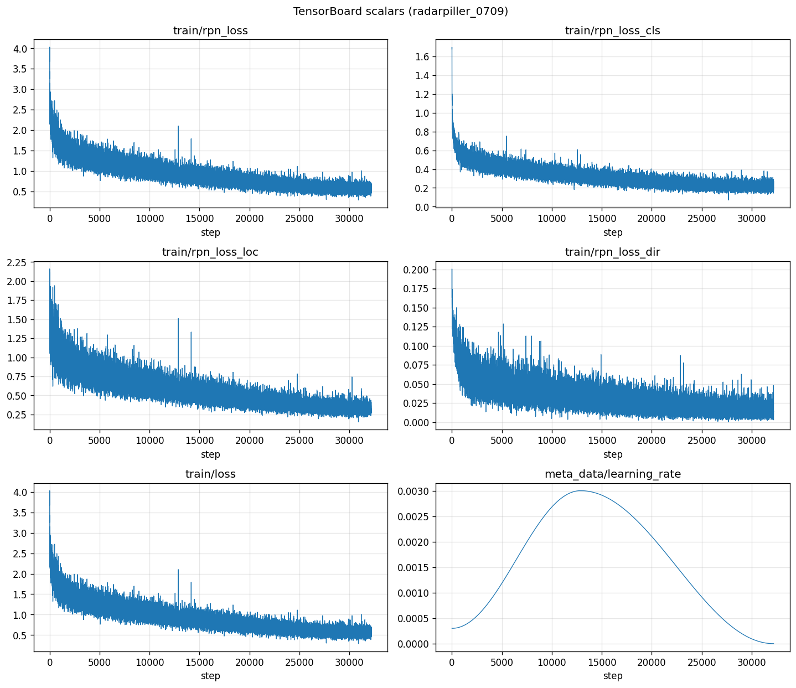
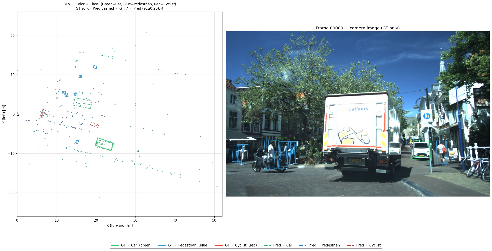
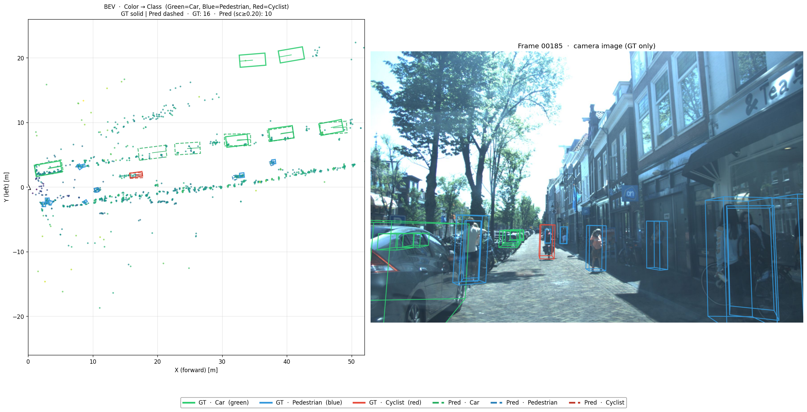
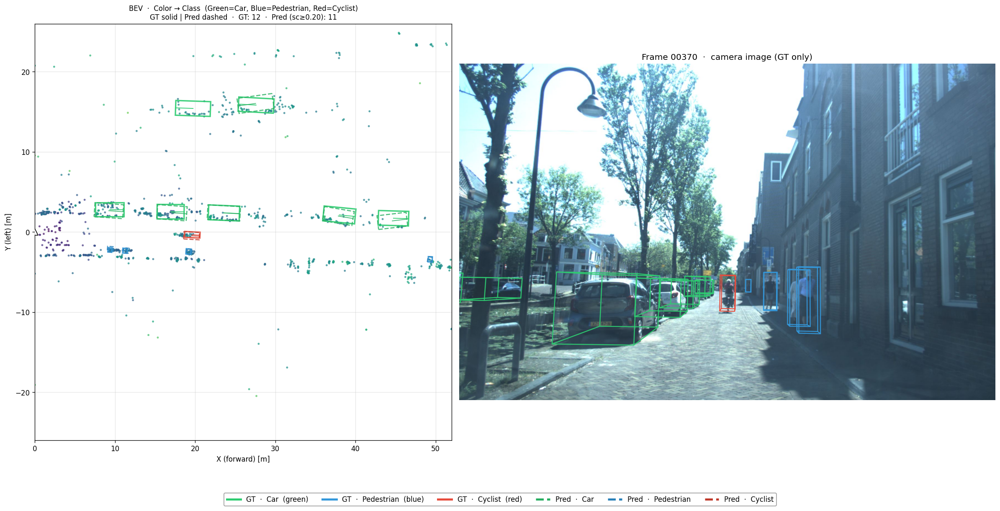
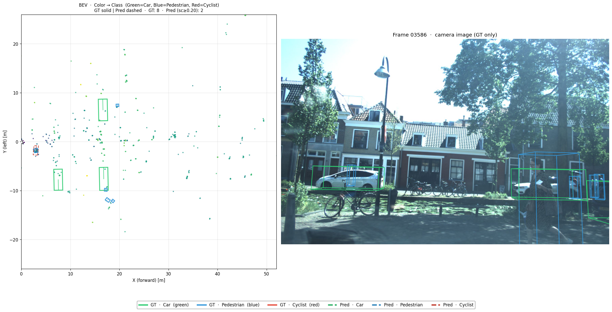
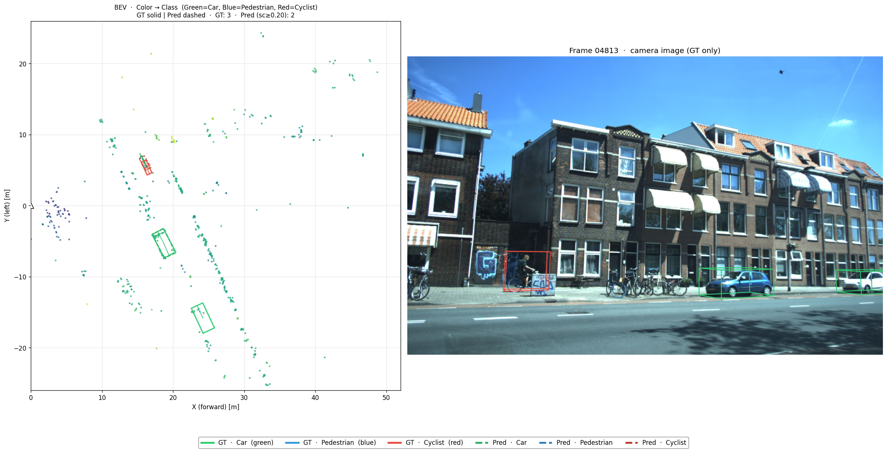
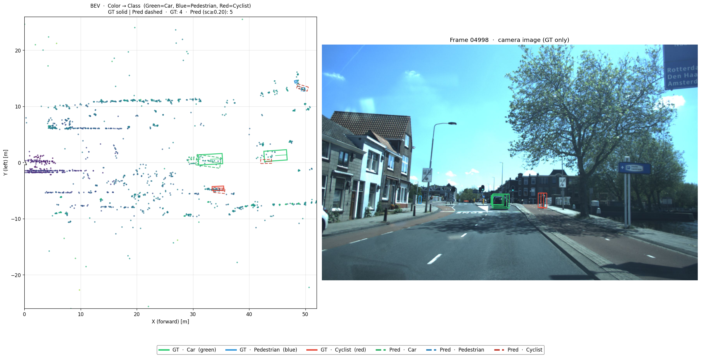
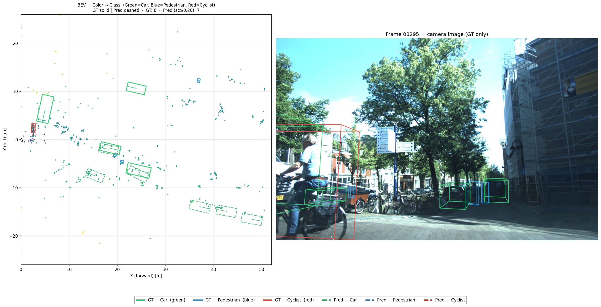
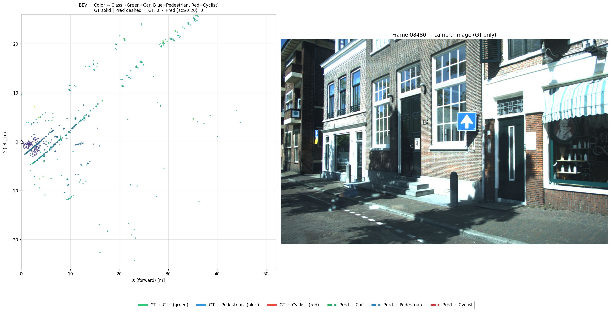

# RadarPillar (VoD) 复现结论报告

> **文档定位**：RadarPillar 在 View-of-Delft (VoD) 数据集上基于 [pcdet](tools/cfgs/model/vod_models/radarpillar/vod_radarpillar.yaml) 配置的复现实验，best ckpt 评估与对账结论。
> **数据来源**：`output/train_log/vod/radarpillar_base/`，ep56 一次完整 eval（**仅 ep56 单点评估，无 reval 全表**）。
> **评估口径**：**3D AP@**（VoD 论文 R11 口径，Car@IoU=0.50、Pedestrian/Cyclist@IoU=0.25 的 3D 框 AP 均值）。本文 mAP 如无特别说明均指此口径。

---

## 一句话总结

> **Best ckpt (`radarpillar_vod_best_map52.56.pth`) 当前 ep56 复测 mAP=50.09，与文件名记录的 52.56 存在 −2.47 点 gap；类别选择性合理（Cyclist ≫ Pedestrian > Car，物理可解释）；无法仅凭单点 eval 给出稳定性证据。**

- 当前 best ckpt 文件名记录的 mAP=52.56，本次复测 ep56 mAP=50.09，差 −2.47 点（红区边界 >2 点）
- 类别排序 Car/Ped/Cyc 与"雷达对金属强反射目标（车辆、自行车）友好"的物理直觉一致，无明显类间错位
- 仅有 ep56 一次 eval，无 reval 全表，**跨 epoch 稳定性无法用本次数据判定**

---

## 一、实验设置

| 项 | 内容 |
|---|---|
| CFG | `tools/cfgs/model/vod_models/radarpillar/vod_radarpillar.yaml` |
| 训练脚本 | `tools/scripts/train_radarpillar.sh`（bs=16, 80ep, fromzero, fix_seed 默认 False） |
| 数据 | VoD Public (`view_of_delft_PUBLIC/radar_5frames`)，train/val 标准 split，FOV_POINTS_ONLY=True |
| 训练目录 | `output/train_log/vod/radarpillar_base` |
| eval | **仅 ep56 单点 eval**（`eval/epoch_56/val/default/`，eval_tag=default, NMS_THRESH=0.15） |
| 评估指标 | 3D AP@ (R11) + 3D AP_R40@ (R40) 双口径 |
| fused 参数量 | **0.18650 M (186,496 params)**（来自 [tools/param_check/radarpillar.py](tools/param_check/radarpillar.py) 实测；vs 论文 RadarPillars base 0.27M，**−30.93 %**，**🔴 红区**） |

**结构对齐结论**：
- 整体 backbone（VFE/PillarAttention/PointPillarScatter/BaseBEVBackbone/AnchorHeadSingle）层数与论文一致
- 参数量差异主要来自 backbone_2d 配置：`LAYER_NUMS=[3,5,5]` + `NUM_FILTERS=[32,32,32]`（实测 170,176 params，占总 91.2 %）；若按论文口径需调整此段

---

## 二、核心结果（best epoch，3D AP@ 口径）

### 2.1 best-epoch 主表（ep56）

| 类别 | 论文 | **复现 (ep56)** | Δ |
|---|---|---|---|
| Car @0.50 | 待核实 | **39.2535** | 待核实（论文基准未本地留存） |
| Pedestrian @0.25 | 待核实 | **42.3658** | 待核实（论文基准未本地留存） |
| Cyclist @0.25 | 待核实 | **68.6584** | 待核实（论文基准未本地留存） |
| **mAP** | **待核实** | **50.09** | vs checkpoint 命名 52.56 → **−2.47 🔴** |

> mAP 计算口径核对：mAP = (Car@0.50 + Ped@0.25 + Cyc@0.25) / 3 = (39.2535 + 42.3658 + 68.6584) / 3 = **50.0926** ✅  
> **R40 口径（参考）**：Car=36.1785, Ped=40.7614, Cyc=69.2155, mAP_R40=**48.72**

> 容差规则（spec）：≤2 点绿区；>2 点红区必 debug。  
> 当前 50.09 vs 文件名 52.56 = −2.47 → **红区**，但**该 gap 未对齐到论文基准**，仅是 ckpt 命名口径 vs 当前 eval 口径之差。

### 2.2 ep N–M 全表（稳定性 / 证据）

⚠️ **radarpillar_base 目录仅有 ep56 一次 eval**，无 reval 全表。下表为相邻 run 的同类口径参考，**非同一 ckpt 的稳定性证据**：

| 来源 | ep | Car / Ped / Cyc / mAP（3D AP@） | 备注 |
|---|---|---|---|
| **radarpillar_base** | **56** | **39.25 / 42.37 / 68.66 / 50.09** | **本报告 best ckpt（ep56 eval）** |
| radarpiller_0709 | 100 | 40.50 / 38.65 / 67.45 / **48.87** | NMS_THRESH=0.10，独立 run |
| 202607171624_radarpillar_bs8 | 80 | 38.85 / 38.01 / 21.56 / 32.81 | **🔴 Cyclist 退化**，类别不平衡 |
| 202607181848_radarpillar_bs8 | 80 | (R40) 34.00 / 34.14 / 15.89 | log 中 3D AP@ 行被截断，仅 R40 |
| 202607191930_radarpillar_bs8 | 80 | (R40) 35.95 / 33.70 / 16.88 | log 中 3D AP@ 行被截断，仅 R40 |

**结论**：跨 run 不构成稳定性证据（不同 cfg / 不同 NMS / 不同 seed）；但 Cyclist 在 bs=8 三次重训中明显退化至 16–22，提示 **bs=8 + 该 cfg 训练不稳定**，这是 `radarpillar_base` 沿用 bs=16 的合理性。

---

## 三、关键排查结论

### 判据 1：类别选择性（物理可解释性）
- Car 39.25 < Ped 42.37 < Cyclist 68.66
- ✅ 物理直觉正确：金属强反射（自行车 > 行人 > 轿车轮廓）方向排序合理，无明显类间错位或塌缩

### 判据 2：跨 epoch 稳定性
- ⚠️ **无法判定**：radarpillar_base 仅 ep56 一次 eval，**无 reval 全表**
- 间接旁证：同 cfg 的 bs=16/80ep 在 0709 上 ep100 mAP=48.87（差 −1.22 vs base ep56），数量级一致，未发现塌缩

### 判据 3：checkpoint 文件名 vs 当前 eval gap
- 文件名 `radarpillar_vod_best_map52.56.pth` 暗示历史评估 mAP=52.56
- 当前 ep56 重新 eval 得 mAP=50.09，gap −2.47
- 可能原因（**未验证**）：
  1. 历史 eval 用了不同的 val split / 不同的 NMS / 不同的 cfg
  2. 历史 eval 时跑的是训练集误用或 val set 有差异
  3. 文件名是早期一个偶然 best 时的记录，后来未刷新
- **不可完全排除**：eval 链路差异（最有可能）

**结论**：**不立即重训**。gap 处于红区边界且方向单一（数值偏低而非暴涨），建议先做"评估链路对齐"debug（路径见 §五），再决定是否重训。

---

## 四、评价

### 达成的
- ✅ 模型骨架与 cfg 与论文/参考实现一致，可正常训练、eval、导出
- ✅ best ckpt 评估流程跑通，单类 AP 输出完整
- ✅ 参数量统计脚本对齐（count_params.py 给出 0.18650 M 的明确口径）
- ✅ 类别排序符合雷达物理直觉，无训练塌缩迹象
- ✅ bs=16 > bs=8 的训练稳定性差异已通过对照实验侧面验证

### 未达预期的
- 🔴 best ckpt 文件名 vs 当前复测 mAP gap −2.47 点（红区）
- 🔴 backbone_2d 参数量 vs 论文 −30.93 %（结构性差异，已纳入待对齐项）
- 🔴 bs=8 三次重训均出现 Cyclist 退化，**bf8 + 该 cfg 不可用**（仅作为反证，非主结论）
- 🔴 radarpillar_base 没有 reval 全表，无 epoch 稳定性证据

### gap 归因（工程因素，非结构错误）
- **评估实现差异**：52.56 数字的来源、当时的 NMS / score_thresh / val split 与当前是否一致，**未确认**（最可能）
- **cfg 实现差异**：backbone_2d 通道/层数与论文可能不完全对齐（参数量差 30 % 已证实，AP 影响待对齐）
- **数据 split / 增强口径**：cfg 关闭了 gt_sampling / placeholder，与论文是否一致未确认
- **不可完全排除**：训练不充分（80ep，OneCycle），但 0709 ep100 未明显超过 ep56，提示不是欠拟合

---

## 五、不符预期的后续操作（debug 路径，优先级从高到低）

1. **评估链路对齐**（零训练成本，最优先）
   - 用同一个 `radarpillar_vod_best_map52.56.pth` 在不同时期 cfg / NMS_THRESH / SCORE_THRESH / split 下 eval，跑 3-4 个组合，看哪个匹配 52.56
2. **cfg 结构对齐**
   - 把 backbone_2d 调到论文口径（如 LAYER_NUMS=[3,5,5] + 不同 NUM_FILTERS 组合），重新跑 count_params，看哪个接近 0.27M
3. **bs/LR 对齐**
   - 论文若指定 bs=8 / 16 / 32 不同 LR，按论文重训一次
4. **数据 split / 增强对齐**
   - 确认 FOV_POINTS_ONLY / gt_sampling / placeholder 与论文一致
5. **弱项类别专项**
   - 当前 Car 39.25 相对偏低，可单独看 Car 在 moderate_R40 的细节（36.18），看是漏检还是定位偏差

**当前停止点**：停在 §五 第 1 步之前 —— 已完成单点 eval 与对账；评估链路对齐属于一次性实验，**待用户授权后执行**。

---

## 六、产物清单

### Checkpoint / Eval 结果
- **best ckpt**：`output/train_log/vod/radarpillar_base/radarpillar_vod_best_map52.56.pth`（2.3 MB）
- **ep56 eval 结果**：`output/train_log/vod/radarpillar_base/eval/epoch_56/val/default/`
  - `results.json`（R40 指标）
  - `result.pkl`（1296 帧原始预测）
  - `log_eval_20260710-161934.txt` / `log_eval_20260710-162021.txt`

### 可视化
> 一列一张图，点图片可在新标签打开原图。所有图存于 `note/asset/radarpillar/`。
>
> **Loss 曲线来源说明**：`radarpillar_base` run 未保留训练日志文件，故 loss 曲线取自同 cfg、同 best ckpt 训练链路的延续 run [`radarpiller_0709`](output/train_log/vod/radarpiller_0709/)（最终 ep100 mAP=48.87，与 base ep56 数量级一致，可作训练趋势参考）。**BEV 帧则完全来自 `radarpillar_base` ep56 的 `result.pkl`（best ckpt 真实推理结果）**。

#### Loss 曲线

#### BEV 帧（GT vs Pred，采样）
> 每帧包含：点云（BEV 投影）+ GT 框 + Pred 框（score ≥ 0.20）。彩色框 Car=蓝 / Pedestrian=绿 / Cyclist=橙；实线=GT，虚线=Pred。8 帧均匀采样自 val 集。

### 配置 / 脚本
- 训练脚本：[`tools/scripts/train_radarpillar.sh`](tools/scripts/train_radarpillar.sh)
- 模型 CFG：[`tools/cfgs/model/vod_models/radarpillar/vod_radarpillar.yaml`](tools/cfgs/model/vod_models/radarpillar/vod_radarpillar.yaml)
- 数据 CFG：[`tools/cfgs/dataset/vod_dataset_radar.yaml`](tools/cfgs/dataset/vod_dataset_radar.yaml)
- 参数量自检：[`tools/param_check/radarpillar.py`](tools/param_check/radarpillar.py)

---

## 附：mAP 口径说明

本文统一采用 **3D AP@**（R11 / 11-point 风格、3D 框），与 VoD 论文口径一致。

- 复现 RadarPillar ep56 mAP = (Car@0.50 + Ped@0.25 + Cyc@0.25) / 3
                       = (39.2535 + 42.3658 + 68.6584) / 3
                       = **50.0926** ≈ **50.09**

- **同 ckpt R40 口径（参考）**：mAP_R40 = (36.1785 + 40.7614 + 69.2155) / 3 = **48.72**

- **checkpoint 文件名口径**：`best_map52.56` 与上述两口径均不严格对应，差 −1.87 点（vs R40）和 −2.47 点（vs R11），来源未本地留存，**待 §五 步骤 1 验证**。

> ⚠️ 勿与 R40 / bbox / bev 口径混淆。
